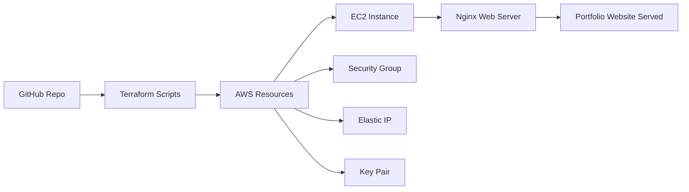

# 🌐 Portfolio on AWS EC2


> Deploy your personal portfolio website on AWS EC2 with Terraform and Nginx. Learn AWS, Terraform IaC, and CI/CD automation in a single project.

---


## 🚀 Project Overview

This project demonstrates how to deploy a **static portfolio website** on AWS EC2 using **Infrastructure as Code (IaC)** principles with **Terraform**.  

**Key Highlights:**

- Free-tier compatible **t3.micro Ubuntu EC2 instance**
- **Nginx** for serving the website
- **Elastic IP** for static access
- **SSH restricted** to your IP for security
- Supports **existing SSH key pair** for secure login
- Optional **GitHub Actions CI/CD workflow** for automatic deployment

---

## 🏗️ Architecture



## 🗂️ Project Structure

```
Portfolio-on-AWS-EC2/
├─ .github/                 # GitHub Actions workflows
├─ .terraform/              # Terraform local cache (ignored)
├─ main.tf                  # EC2, Security Group, Key Pair, EIP resources
├─ variables.tf             # Terraform input variables
├─ outputs.tf               # Terraform outputs
├─ userdata.sh              # Script to install Nginx & deploy website
├─ index.html               # Portfolio web page
├─ mahesh.pub               # SSH public key
├─ terraform.tfstate        # Terraform state file (ignored)
├─ LICENSE
├─ README.md
└─ .gitignore
```


## ⚙️ Prerequisites

- **Terraform**: v1.5+
    
- **AWS Account**: IAM user with permissions:
    
    - `ec2:RunInstances`
        
    - `ec2:CreateKeyPair`
        
    - `ec2:CreateSecurityGroup`
        
    - `ec2:AllocateAddress`
        
    - `ec2:Describe*` permissions
        
- **Existing SSH Key Pair** (optional but recommended)
    
- **GitHub Account** (for CI/CD)


## 🔧 Setup & Deployment

### 1. Clone the Repository

```hcl
https://github.com/MaheshShukla1/Portfolio-on-AWS-EC2.git
cd Portfolio-on-AWS-EC2
```

### 2. Configure Variables

Edit `variables.tf`:

```hcl
variable "key_name" {
  default = "mahesh"
}

variable "public_key_path" {
  default = "C:/Users/Admin/Portfolio-on-AWS-EC2/mahesh.pub"
}

variable "my_ip" {
  default = "YOUR_PUBLIC_IP/32"
}
```

### 3. Initialize Terraform

```
terraform init
```

### 4. Plan & Apply Deployment

```
terraform plan
terraform apply -auto-approve
```

### 5. Access the EC2 Instance

```
ssh -i "yourkey.pem" ubuntu@<EC2_PUBLIC_IP>
```

### 6. View Your Portfolio

Open in browser:

```
http://<EC2_PUBLIC_IP>/
```


## 🛡️ Security Best Practices

- **Do not commit private keys** (`.pem`) to GitHub.
    
- Use **`.gitignore`** to exclude sensitive files:

## 🔖 License

This project is licensed under the **MIT License**. See [LICENSE](LICENSE) for details.


